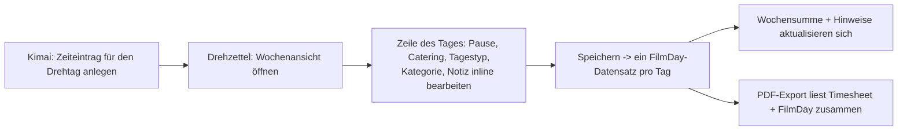
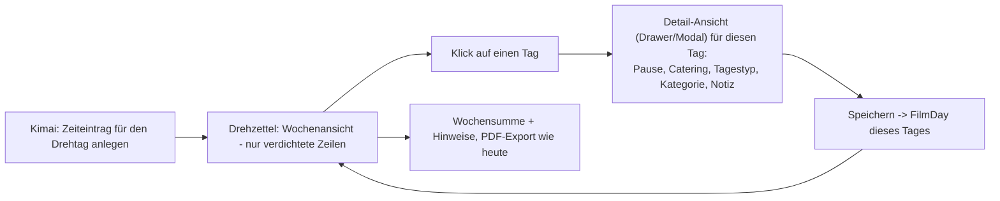
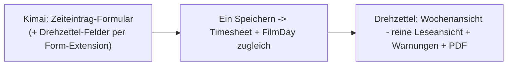

# UX question: where does per-day film data live, and where is it edited?

Raised 2026-09-22 while reworking the week and ruleset-rules pages. Not a decision, a discussion
starting point for the next session that touches this UI. See `roadmap.md` → Open for the pointer
back here.

## Where the data actually lives today

Kimai's own `Timesheet` entity only has `begin`, `end`, `activity`, `project`, `user`, `description`
and a few more generic fields - nothing film-specific. Everything the Drehzettel week view lets you
set per day - break minutes, catering, day type (workday/travel), a category override
(Saturday/Sunday/holiday/auto), the note - lives in the plugin's **own** `FilmDay` entity
(`Entity/FilmDay.php`): one row per `(engagement, date)`, related to a `Timesheet` only by sharing a
calendar date, not by a foreign key.

`Service/DayInputBuilder.php` merges the two per day: begin/end/gross time come from Kimai's
`Timesheet` entries (`TimesheetRangeRepository`), everything else comes from `FilmDay`
(`FilmDayRepository`) if a row exists, else from rule-based defaults (weekday → category, ruleset →
break). The week view (`Controller/WeekController.php`, `Service/WeekPageBuilder.php`) is the *only*
place that reads or writes `FilmDay` - confirmed by grepping for `FilmDayService`/`FilmDayRepository`
usage, both only appear there. So today's inline dropdowns are not a second path to something Kimai
already offers; they are the one and only UI this data has, because Kimai has no fields for it at all.

## The open question

Is "one wide-ish row per day, inline-editable, in a page that also shows the whole week's calculated
totals" still the right shape once this page gets busier (more columns, compliance warnings, PDF
options)? Or should day-level editing move to its own surface, with the week view reduced to an
overview? A related question: should this data live in the *Kimai* timesheet-entry flow at all
(entered once, where the crew member already is, instead of a second screen), even though Kimai core
has no fields for it?

## Three candidate flows (not decisions - discussion input)

### A. Today: everything inline in the week table

Pros: one page, one save, fast for editing several days in a row (e.g. catching up a whole week at
once). Cons: the row has to carry both "quick glance" data (work time, pay) and "occasional edit"
data (note, category override) at once - the exact tension the redesign is trying to manage with
chips and pills instead of table columns.

### B. Day detail drawer, week view becomes an overview

Pros: the week view stays a clean, glanceable list even with more per-day detail later (signature
per day? multiple notes? time-account bookings?). Matches how Kimai's own timesheet list works
(click a row → edit form). Cons: one more click per day; editing several days back-to-back is slower
than tabbing across a row.

### C. Push the fields into Kimai's own timesheet-entry form

Pros: no second place to remember to fill in; the crew member (or whoever books the entry) sets
break/catering/day type/category exactly where they already are. Matches the roadmap's own framing
("One continuous shooting day = one Kimai timesheet entry"). Cons: needs a Kimai form-extension
integration (`FormExtensionInterface` on Kimai's `TimesheetEditType`), which is a real architectural
commitment - the plugin currently stays fully additive/inert without an engagement (`roadmap.md`
Concept section); wiring into Kimai's own form changes that. Also: engagement/ruleset lookup has to
happen at entry-creation time, which needs the project to already have an active engagement for that
user - fine for the common case, unclear for edge cases (entry created before an engagement exists,
or backdated).

## Not yet considered here

- Whether film day data should be editable in bulk (e.g. "same break for the whole week") regardless
  of which of the above wins.
- How this interacts with the still-open holiday-plugin-installed check (`roadmap.md`): once a
  holiday is auto-detected, does the category override even need to be a manual field most weeks, or
  only a rare correction?
- Mobile/on-set entry: is any of this realistically filled in on a phone during a shoot, or always
  after the fact at a desk? That changes how much a drawer/modal vs. inline row actually matters.
