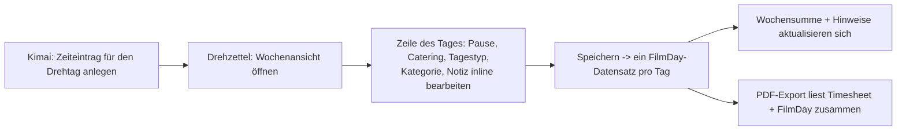
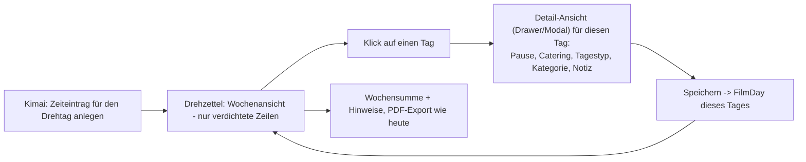
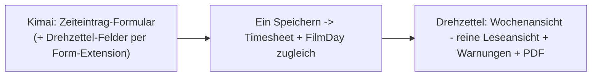

# UX question: where does per-day film data live, and where is it edited?

Raised 2026-09-22 while reworking the week and ruleset-rules pages. Not a decision, a discussion
starting point for the next session that touches this UI. See `roadmap.md` → Open for the pointer
back here. Graphical version of the state and the three candidate flows (CSS flowcharts plus UI
mockups, self-contained, no CDN): `research/ux-flows-film-day-data.html`.

## Where the data actually lives today

Kimai's own `Timesheet` entity only has `begin`, `end`, `activity`, `project`, `user`, `description`
and a few more generic fields - nothing film-specific. Everything the Drehzettel week view lets you
set per day - break minutes, catering, day type (workday/travel), a category override
(Saturday/Sunday/holiday/auto), the note - lives in the plugin's **own** `FilmDay` entity
(`Entity/FilmDay.php`): one row per `(engagement, date)`, related to a `Timesheet` only by sharing a
calendar date, not by a foreign key.

`Service/DayInputBuilder.php` merges the two per day: begin/end/gross time come from Kimai's
`Timesheet` entries (`TimesheetRangeRepository`), everything else comes from `FilmDay`
(`FilmDayRepository`) if a row exists, else from rule-based defaults (weekday → category, ruleset →
break). The week view (`Controller/WeekController.php`, `Service/WeekPageBuilder.php`) is the *only*
place that reads or writes `FilmDay` - confirmed by grepping for `FilmDayService`/`FilmDayRepository`
usage, both only appear there. So today's inline dropdowns are not a second path to something Kimai
already offers; they are the one and only UI this data has, because Kimai has no fields for it at all.

## The open question

Is "one wide-ish row per day, inline-editable, in a page that also shows the whole week's calculated
totals" still the right shape once this page gets busier (more columns, compliance warnings, PDF
options)? Or should day-level editing move to its own surface, with the week view reduced to an
overview? A related question: should this data live in the *Kimai* timesheet-entry flow at all
(entered once, where the crew member already is, instead of a second screen), even though Kimai core
has no fields for it?

## Three candidate flows (not decisions - discussion input)

### A. Today: everything inline in the week table

Pros: one page, one save, fast for editing several days in a row (e.g. catching up a whole week at
once). Cons: the row has to carry both "quick glance" data (work time, pay) and "occasional edit"
data (note, category override) at once - the exact tension the redesign is trying to manage with
chips and pills instead of table columns.

### B. Day detail drawer, week view becomes an overview

Pros: the week view stays a clean, glanceable list even with more per-day detail later (signature
per day? multiple notes? time-account bookings?). Matches how Kimai's own timesheet list works
(click a row → edit form). Cons: one more click per day; editing several days back-to-back is slower
than tabbing across a row.

### C. Push the fields into Kimai's own timesheet-entry form

Pros: no second place to remember to fill in; the crew member (or whoever books the entry) sets
break/catering/day type/category exactly where they already are. Matches the roadmap's own framing
("One continuous shooting day = one Kimai timesheet entry"). Cons: needs a Kimai form-extension
integration (`FormExtensionInterface` on Kimai's `TimesheetEditType`), which is a real architectural
commitment - the plugin currently stays fully additive/inert without an engagement (`roadmap.md`
Concept section); wiring into Kimai's own form changes that. Also: engagement/ruleset lookup has to
happen at entry-creation time, which needs the project to already have an active engagement for that
user - fine for the common case, unclear for edge cases (entry created before an engagement exists,
or backdated).

## Not yet considered here

- Whether film day data should be editable in bulk (e.g. "same break for the whole week") regardless
  of which of the above wins.
- How this interacts with the still-open holiday-plugin-installed check (`roadmap.md`): once a
  holiday is auto-detected, does the category override even need to be a manual field most weeks, or
  only a rare correction?
- Mobile/on-set entry: is any of this realistically filled in on a phone during a shoot, or always
  after the fact at a desk? That changes how much a drawer/modal vs. inline row actually matters.

## 2026-09-23 — Entscheidungsrichtung und technischer Stand

### Decided direction: variant C

Save timesheet and film day in **one** action. The week view becomes the **primary read view** with an
optional edit mode for quick corrections (same fields, same save path, just toggled on/off). The film
day fields in Kimai's timesheet form are **not permanently visible** — they appear conditionally.
This supersedes "not a decision" for the *shape* of the flow; the open parts are the toggle's location
(below) and the break-field conflict.

### The toggle idea (open — needs an answer)

A toggle for "film day", to be built into a Kimai dialog, that steers two things at once:

1. which entries land on the week view for the production (the morning's 1–2 h of freelance work
   before switching to the film activity must **not** show up there), and
2. whether the film day fields (break, catering, category, note) appear in the timesheet form at all.

Four candidate placements — **not yet answered:**

- **A. Toggle on the activity** (`ActivityMetaDefinitionEvent` → meta checkbox): a marked activity
  both counts for the week view and shows the film fields when selected. Filter = "entries whose
  activity is marked". One place to maintain, but whole days are either in or out.
- **B. Toggle per timesheet entry** (field in the form, `mapped: false`): film fields appear only
  after the box is checked; only checked entries count. Finest granularity (half day film, rest
  something else), but has to be set per entry.
- **C. Combination**: activity toggle as the default, per-entry toggle as the override.
- **D. No toggle**: fields show whenever the project has an active engagement; freelance work runs
  on a different project anyway and is already excluded. Then a visibility rule alone suffices,
  with no filter logic.

### Technical stand (verified against Kimai 2.67.0)

- **Form extension works and follows Kimai's own pattern**: an `AbstractTypeExtension` targeting
  `TimesheetEditForm` (like core's `EnhancedChoiceTypeExtension`), registered via
  `autoconfigure: true` in our `Resources/config/services.yaml`. Gotcha: `TimesheetAdminEditForm`
  extends the *class* but is registered as its own type — list **both** types in
  `getExtendedTypes()`, or the fieldset is missing from the admin form.
- **Events carry only the entity, not the submitted field values**: `TimesheetCreatePostEvent` /
  `TimesheetUpdatePostEvent` expose just the `Timesheet`. With `mapped: false` film fields, saving
  must happen on the form itself (`POST_SUBMIT`, only when the form has no errors), then look up the
  engagement via `EngagementService::active(user, project, date)` — which already exists. No active
  engagement → skip the film day, the plugin stays inert (roadmap Concept). Alternative with more
  Kimai-native rendering/storage: `TimesheetMetaDefinitionEvent` for meta fields; film day stays the
  source for the week view either way.
- **The filter sits at exactly one place**: `Repository/TimesheetRangeRepository::findClosed()`
  filters by user + project only, and `DayInputBuilder` merges everything into one span (earliest
  begin → latest end). Filtering entries/activities there fixes every downstream consumer at once:
  day span, sums, compliance, PDF.
- **Existing bug this surfaces**: freelance entries on the *same* project already inflate the
  shooting day today — they feed the span, the work time and the pay. The filter is therefore not
  just sorting, it is a correction. (If freelance work always runs on a different project, part of
  this is already handled — needs confirming before building filter logic.)
- **Conflict to resolve**: Kimai's timesheet form has a native `break` field (when break time is
  enabled in system settings), running parallel to our `FilmDay.breakMinutes`. Two break fields in
  one form is confusing — decide which one wins before wiring the form extension.

### Open questions for the next session

- Answer the toggle placement: A, B, C or D (above).
- Native Kimai `break` vs. `FilmDay.breakMinutes`: one field or two, and which one the calculation
  reads.
- Confirm whether the morning's freelance work really shares the project (filter needed) or not
  (visibility rule only).

## 2026-09-23 (Fortsetzung) — die drei offenen Fragen entschieden

### Freelance/Projekt-Filter: kein Filter nötig

`roadmap.md`'s Concept-Diagramm sagt es bereits: das Film-Projekt ist "not billable, no freelance
client". Freelance-Arbeit läuft also strukturell nie auf demselben Projekt wie ein Engagement — es
gibt keinen Fall, in dem Timesheet-Einträge desselben Projekts teils Film, teils Freelance sind. Ein
Filter in `TimesheetRangeRepository::findClosed()` ist damit unnötig; eine reine Sichtbarkeitsregel
("Projekt hat aktives Engagement") reicht.

### Toggle: Hybrid — Engagement setzt ihn automatisch, manuell überschreibbar

Keine der vier Varianten A–D trifft es allein. Entschieden: der Toggle **existiert** als Feld im
Formular, wird aber **vorbelegt durch das Engagement** (Projekt + User haben ein aktives Engagement
→ Toggle an, Film-Day-Felder sichtbar). Die Nutzerin kann ihn manuell umschalten (z. B. ein Tag, der
trotz aktivem Engagement kein Drehtag war — Krankheit, Verwaltung). Das ist näher an Variante B/C als
an D: pro Eintrag entscheidbar, aber mit sinnvollem Default statt Pflichteingabe. Der Wochenansicht-
Filter folgt demselben Toggle-Zustand, nicht nur dem Engagement.

### Break-Feld: `FilmDay.breakMinutes` führt, wird in `Timesheet.break` gespiegelt

Kimais natives `break`-Feld liegt auf der `Timesheet`-Entity und speist Kimais eigene
Dauerberechnung (`duration = end - begin - break`) — und damit alles, was darauf aufbaut: Standard-
Zeitliste, Reports, Invoicing, API. Lässt man es unbeachtet, während nur `FilmDay.breakMinutes`
gepflegt wird, rechnen Kimais Kernfunktionen mit einer falschen (meist 0-minütigen) Pause an
Drehtagen — ein stiller Fehler außerhalb des Plugins.

Entschieden: `FilmDay.breakMinutes` bleibt die einzige Eingabe (Ruleset-Default, pro Tag
überschreibbar, wie in Zeile 20 des Roadmap-Konzepts beschrieben). Das native `break`-Feld wird im
Formular ausgeblendet, sobald die Film-Day-Felder sichtbar sind, aber beim Speichern
(`POST_SUBMIT`-Handler der Form-Extension) programmatisch mit dem `FilmDay.breakMinutes`-Wert
befüllt, damit Kimais Kern konsistent bleibt.

Kein Konflikt mit dem bestehenden Nutzungsmuster außerhalb von Drehtagen: dort wird keine Pause im
Feld erfasst, sondern die Tätigkeit für die Pause gestoppt und danach neu gestartet (`break` bleibt
0). Der Sync betrifft also ausschließlich Einträge, die ohnehin über die Film-Day-Felder laufen.

### Damit offen für die Umsetzung

- Formular-Extension bauen (Toggle-Feld + bedingt sichtbare Film-Day-Felder + Break-Sync im
  `POST_SUBMIT`).
- Wochenansicht-Filter auf den Toggle-Zustand umstellen (statt nur Engagement-Vorhandensein).
- Edit-Modus für die Wochenansicht (Variante C: primäre Leseansicht + optionaler Inline-Edit,
  gleicher Save-Pfad).

## 2026-09-23 (Revision) — Break-Sync verworfen: Felder bleiben getrennt

Die Sync-Entscheidung oben ("`FilmDay.breakMinutes` führt, wird in `Timesheet.break` gespiegelt")
ist zurückgenommen, nachdem klar wurde, dass sie implizit auf einem persönlichen Workflow beruhte
(Pause wird sonst nie über das native Feld erfasst, sondern durch Stopp/Neustart der Tätigkeit). Für
eine andere Installation, die Kimais native Break-Funktion tatsächlich benutzt, hätte der Sync
mehrere Probleme aufgeworfen:

- **Datenverlust**: ein bereits im nativen Feld eingetragener Wert würde beim Umschalten auf
  "Filmtag" verschwinden bzw. durch den Ruleset-Default ersetzt, wenn er nicht explizit als
  Vorbelegung übernommen wird.
- **Inkonsistente Formularoberfläche**: dasselbe Feld wäre je nach Toggle-Zustand eines Eintrags mal
  sichtbar, mal ausgeblendet.
- **Umgangene Kimai-Validierung**: Kimais eigene Pausenregeln (Mindestpause, Warnungen) hängen am
  nativen Formularfeld; ein Wert, der erst im `POST_SUBMIT`-Handler programmatisch hineingeschrieben
  wird, durchläuft diese Prüfung nicht.
- **Stille Nebenwirkung auf Kern-Features**: Invoicing, Standard-Reports und die API lesen
  `Timesheet.duration`, die vom `break`-Feld abhängt — ein Sync würde diese Werte für Filmtage
  verändern, ohne dass der Nutzer das im gewohnten (ausgeblendeten) Feld sieht.

**Neue Entscheidung**: `Timesheet.break` und `FilmDay.breakMinutes` bleiben vollständig getrennte
Felder, kein Sync, keine gegenseitige Beeinflussung. Kimais natives Break-Feld verhält sich für
Filmtage genauso wie für jeden anderen Eintrag — wird es benutzt, fließt es in Kimais eigene Dauer
und Reports ein, komplett unabhängig von `FilmDay.breakMinutes`, das ausschließlich die
Plugin-eigene TV-FFS-Berechnung (Wochenansicht, Zuschläge, PDF) speist.

Das passt zur grundsätzlichen Haltung des Plugins: Filmtage werden bewusst als eigene, von normaler
(Freelance-)Arbeit getrennte Kategorie behandelt, mit eigener Datenquelle für die Pause — nicht als
Sonderfall, der in Kimais Kernfelder hineinregiert. Nebeneffekt: das Plugin bleibt unabhängig davon,
ob eine Installation Kimais Break-Funktion überhaupt nutzt oder die Systemeinstellung dafür aktiviert
hat — es gibt keine Kopplung mehr, die getestet oder gepflegt werden müsste.

Damit entfällt auch die Vorbelegungs-/Validierungs-Problematik aus dem vorherigen Absatz — sie war
nur für den Sync-Ansatz relevant.

### Aktualisiert: offen für die Umsetzung

- Formular-Extension bauen (Toggle-Feld + bedingt sichtbare Film-Day-Felder). Kein Break-Sync mehr
  nötig — beide Felder unabhängig lassen.
- Wochenansicht-Filter auf den Toggle-Zustand umstellen (statt nur Engagement-Vorhandensein).
- Edit-Modus für die Wochenansicht (Variante C: primäre Leseansicht + optionaler Inline-Edit,
  gleicher Save-Pfad).

## 2026-09-23 (Fortsetzung 2) — Formkonzept A gewählt, natives Pause-Feld bei aktivem Toggle ausgeblendet

Grafischer Vergleich der drei Formkonzepte (Inline Expand / Detail-Drawer / getrennte Tabs) als
Artefact: `https://claude.ai/artifact/CB2kY9aB66GbHzLTVnTZjS`. Entschieden: **Konzept A — Inline
Expand**. Toggle „Drehtag" oben im Formular, Film-Day-Felder klappen bei aktivem Toggle direkt
darunter als eigener Block auf. Ein durchgehendes Formular, kein Klick/Tab-Wechsel nötig, am
schnellsten für mehrere Tage hintereinander — der Hauptvorteil gegenüber B und C.

Ergänzende Entscheidung zur Zwei-Pause-Verwirrung (siehe Revision oben, die den *Daten*-Sync bereits
verworfen hat): Kimais natives Pause-Feld wird im Formular **ausgeblendet, sobald der Toggle aktiv
ist** — rein visuell, ohne Datenfluss zwischen den Feldern. Das ist kein Widerspruch zur
"getrennte Felder, kein Sync"-Entscheidung, sondern ergänzt sie: die Felder bleiben datenseitig
unabhängig (Kimais `break` wird weder gelesen noch geschrieben), nur die *Anzeige* wird pro
Formularzustand gesteuert — wie in Konzept C ohnehin vorgesehen, hier aber ohne Tab-Wechsel, indem das
Feld einfach aus dem "Allgemein"-Bereich verschwindet statt auf einen zweiten Tab zu wandern.

### Aktualisiert: offen für die Umsetzung

- Formular-Extension bauen: Toggle-Feld, bedingt sichtbare Film-Day-Felder direkt darunter (Inline
  Expand), natives `break`-Feld bei aktivem Toggle per Formular-Logik ausblenden (kein Sync).
- Wochenansicht-Filter auf den Toggle-Zustand umstellen (statt nur Engagement-Vorhandensein).
- Edit-Modus für die Wochenansicht (Variante C: primäre Leseansicht + optionaler Inline-Edit,
  gleicher Save-Pfad).
